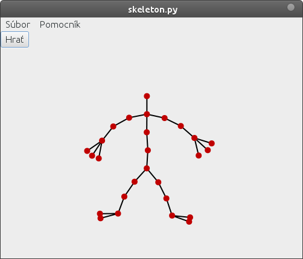
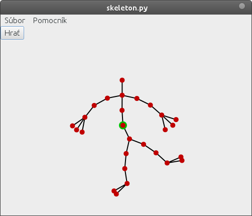
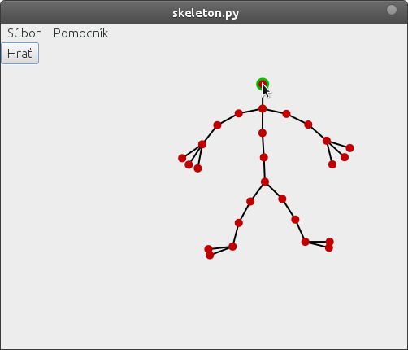
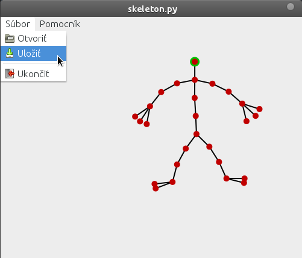
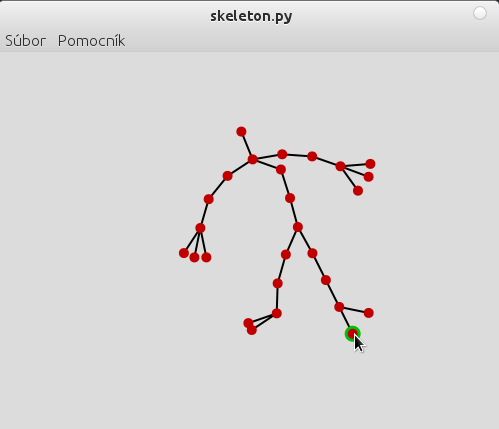

==========
CA project
==========

*autor:* Bc. Vladimir Magyar

Project theme C03 - Inverse Kinematics:
---------------------------------------

- Scene: 2d line-segment skeleton of figure (min 15 bones)
- Implement 2d skeleton creation
        - User can create new bone by selecting parent bone (click on it) and clicking anywhere to define end of bone
        - Bones can have more child bones
        - Each bone has its position, rotation angle and length (end point can be calculated)
        - User can select starting and ending bone of the IK sequence
- Implement forward kinematics
        - Select bone by clicking, change rotation angle by dragging
        - Child bones must be transformed correctly (can use transformation 3x3 matrices - they handle both rotation and translation)
- Implement inverse kinematics (relaxation by gradient calculation)
        - User can move end bone - IK solves bones in the IK sequence

Implementation
--------------

:programing language: `python 3.2 <www.python.org>`_
:graphical user interface: `GTK3 <https://live.gnome.org/PyGObject>`_
:mathematical library: `numpy <http://numpy.scipy.org/>`_

Progress
--------

- Scene with sceleton: 
        - user can create new bones by clicking on a joint and than right click to a diredtion
        - user can drag the sceleton by clicking on a joint and then draging it
- Forward kinematics:
        - user can rotate the bones by selecting a joint and than draging a child joint, all descendants rotate with it
- Inverse kinematics:
        - user can drag leaf joint and the arm (from root to the leaf) will follow the mouse cursor (while mouse button is down)
- Saving and loading sceletons

The application:

|screenshot01|

Rotating the bones:

|screenshot02|

Draging the sceleton:

|screenshot03|

Saving and loading:

|screenshot04|

Inverse kinematics, draging leaf joint with the mouse:

|screenshot05|

